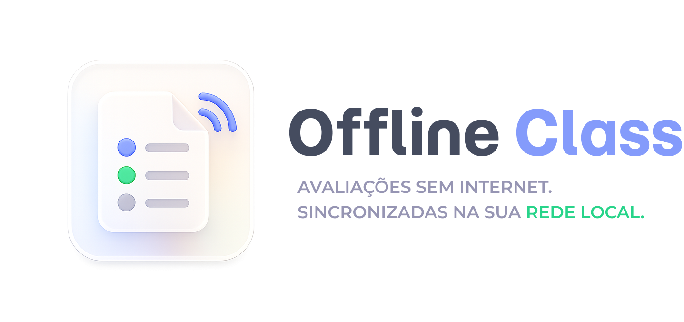

<p align="center">
  
</p>

<p align="center">
  <strong>Plataforma de avaliações digitais colaborativas para salas de aula sem internet.</strong><br/>
  Aplique provas, forme grupos, sincronize alunos em tempo real e exporte resultados — tudo via rede local.
</p>

<p align="center">
  
  
  
  
  
  
</p>

---

## Sobre o projeto

O **OfflineClass** resolve um problema recorrente em ambientes educacionais: aplicar avaliações digitais em salas de aula onde a conexão com a internet é instável, inexistente ou propositalmente desativada para garantir a integridade dos exames.

O foco do projeto está no estudo de **Sistemas Operacionais e Redes**, explorando como construir uma infraestrutura de comunicação robusta em uma rede local (LAN) isolada. O app **roda em Electron na máquina do professor**, e dentro dele há um servidor web que atende os alunos via Wi-Fi da sala. Sessões rodam em **grupos** (aluno individual = grupo de 1), com estado de resposta colaborativo em tempo real dentro de cada grupo. Nenhum dado precisa trafegar por gateways externos — sync opcional pra cloud existe apenas pra backup de definições e upload de resultados, nunca como dependência de runtime.

> **Documentação completa de arquitetura e funcionalidades:** veja [`docs/architecture.md`](docs/architecture.md) (system design) e [`docs/features.md`](docs/features.md) (inventário de features tier CORE/FEATURE/EXTRA).

## Funcionalidades

- **Gestão de provas** — form builder com sete tipos de questão (MCQ única/múltipla, V/F, resposta curta, dissertativa, código, ordenação, associação) e blocos de material auxiliar inline (PDF, imagem, vídeo, link).
- **Multi-professor** — várias contas locais por instalação, com login/senha (bcrypt) e dados isolados por professor.
- **Grupos colaborativos** — três modos de formação (livre, professor-designa, sorteio) ou modo individual. Membros do mesmo grupo veem respostas e cursores um do outro em tempo real, com submit confirmado por todos os membros online.
- **Descoberta automática** — alunos entram via QR code ou URL anunciada por mDNS — sem configuração manual de IPs.
- **Tempo real sobre LAN** — Socket.IO unifica eventos de sessão, presença e colaboração CRDT (Yjs) num só socket TLS sobre HTTPS local.
- **Painel ao vivo do professor** — dashboard com progresso por grupo e sessão de projetor para a turma toda.
- **Resultados** — exportação local em CSV/JSON e, opcionalmente, envio por e-mail via cloud.
- **Sync opcional com cloud (VPS)** — backup das definições de prova e upload dos resultados; sempre manual, nunca obrigatório.

## Stack tecnológica

| Camada               | Tecnologia                                                                |
| -------------------- | ------------------------------------------------------------------------- |
| Desktop (professor)  | Electron + React 19 + Tailwind v4 + shadcn (radix-nova) + TanStack Query  |
| Servidor LAN         | Hono + Socket.IO (`y-socket.io` para Yjs) + Node `https`                  |
| Web do aluno         | React 19 + Vite + Tailwind v4 + shadcn + Yjs + Tiptap + `socket.io-client`|
| Cloud (VPS opcional) | Hono + Postgres + Drizzle                                                 |
| DB local             | better-sqlite3 + Drizzle (WAL mode)                                       |
| Schemas/contratos    | Zod em `packages/shared` (tipos compartilhados client/server)             |
| Descoberta           | mDNS (`bonjour-service`) + QR code (`qrcode`)                             |
| Distribuição         | electron-builder (executável único por SO)                                |

A escolha das ferramentas prioriza um único runtime JavaScript em toda a stack, schemas compartilhados nas duas pontas de cada fronteira, e zero dependência de internet em runtime.

## Arquitetura

```
┌─────────────────────────────────────┐         LAN          ┌─────────────────┐
│        Professor (Electron)         │   HTTPS + Socket.IO  │   Aluno (PC)    │
│  ┌───────────────────────────────┐  │ ◄──────────────────► │  React + Vite   │
│  │ Main process                  │  │                      │  Yjs + Tiptap   │
│  │  • Hono LAN server            │  │      mDNS / QR       │  Socket.IO      │
│  │  • Socket.IO + y-socket.io    │  │ ◄──────────────────► │  client         │
│  │  • SQLite (Drizzle, WAL)      │  │                      └─────────────────┘
│  │  • Cloud sync worker          │  │
│  └───────────────────────────────┘  │
│  ┌───────────────────────────────┐  │  HTTPS (manual)   ┌──────────────────┐
│  │ Renderer (teacher UI)         │  │ ─────────────────►│  Cloud (VPS)     │
│  │ + Projector window            │  │                   │  Hono + Postgres │
│  └───────────────────────────────┘  │ ◄─────────────────│  (sync opcional) │
└─────────────────────────────────────┘                   └──────────────────┘
```

Três fronteiras de protocolo, três zonas de confiança: **Electron IPC** (renderer ↔ main), **HTTPS + Socket.IO em LAN** (alunos ↔ desktop) e **HTTPS pra cloud** (apenas desktop → VPS). O aluno nunca fala com a cloud diretamente. Detalhes completos em [`docs/architecture.md`](docs/architecture.md).

### Layout do monorepo

```
OfflineClass/
├── apps/
│   ├── desktop/       # Electron + Hono LAN server + SQLite
│   ├── student-web/   # SPA do aluno (servida via LAN)
│   └── cloud/         # Servidor opcional (Hono + Postgres)
├── packages/
│   └── shared/        # Schemas Zod, tipos e event maps compartilhados
└── docs/              # architecture.md, features.md
```

## Como começar

> Setup detalhado por app será adicionado conforme cada fase do plano de implementação avança (veja a seção *Implementation phases* em `docs/architecture.md`).

### Pré-requisitos
- Node.js 20+
- pnpm 9+
- Rede Wi-Fi local (não precisa de acesso à internet)

### Instalação (em breve)
```bash
git clone https://github.com/Eliezir/OfflineClass.git
cd OfflineClass
pnpm install
# instruções específicas de cada app (desktop / student-web / cloud) serão documentadas
```

## Equipe

- **Eliezir Moreira**
- **Pedro Roberto**
- **Raphael Phillipe**

Projeto desenvolvido como trabalho acadêmico nas disciplinas de Sistemas Operacionais e Redes.

## Licença

Distribuído sob a licença MIT. Veja o arquivo [LICENSE](LICENSE) para mais detalhes.

---

<p align="center">
  <sub>Feito com foco em ambientes educacionais reais — onde a internet nem sempre coopera.</sub>
</p>
