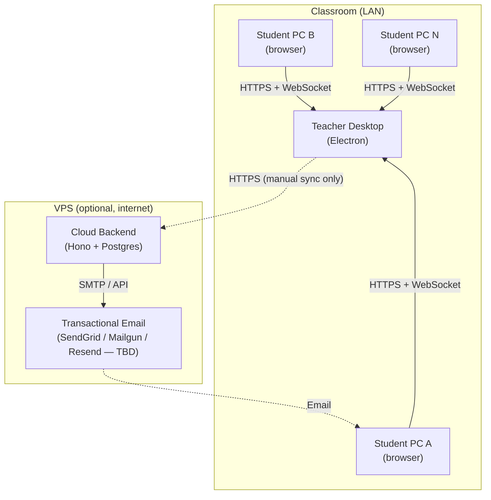
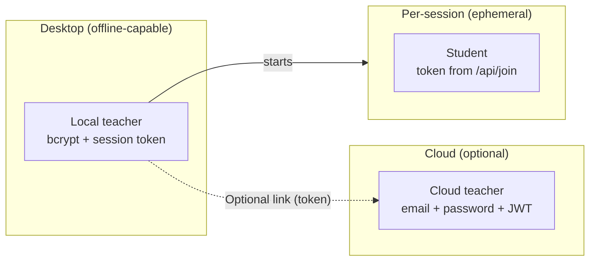
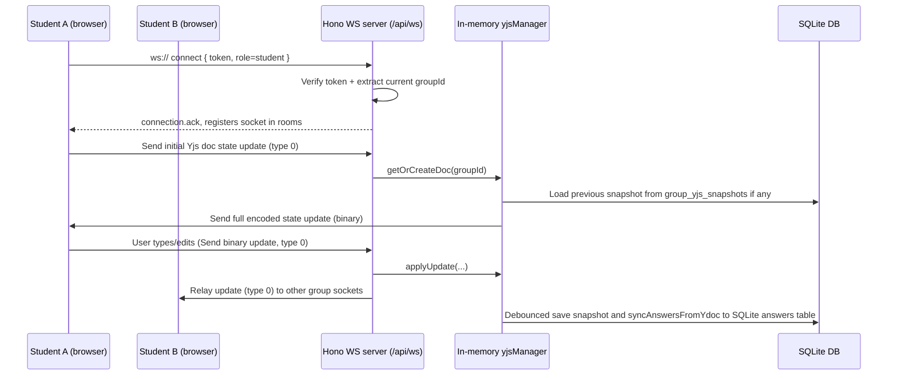
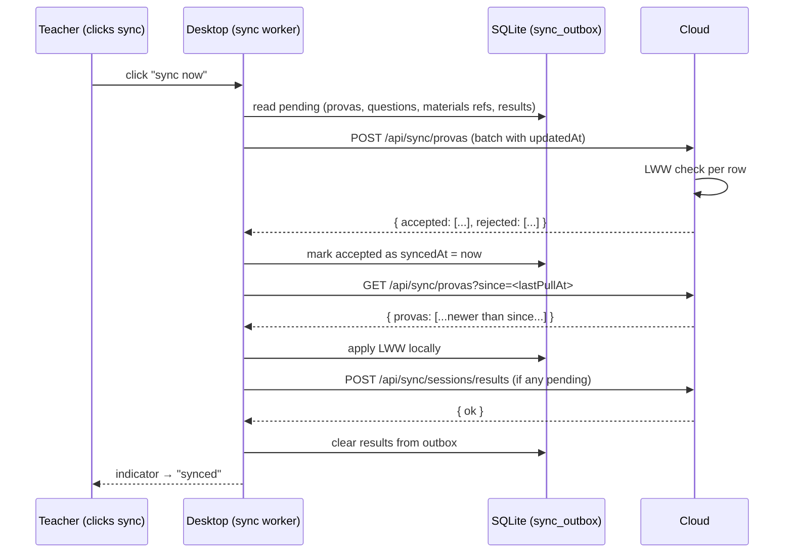
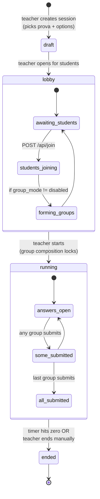
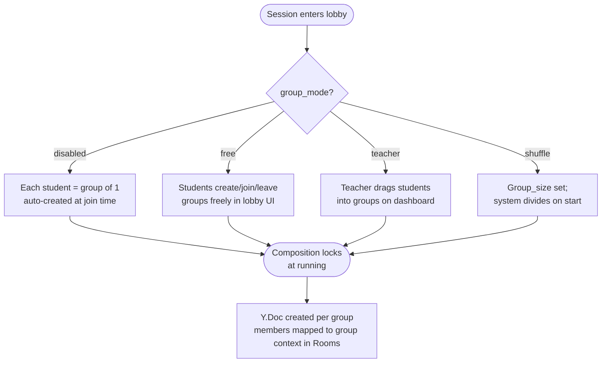
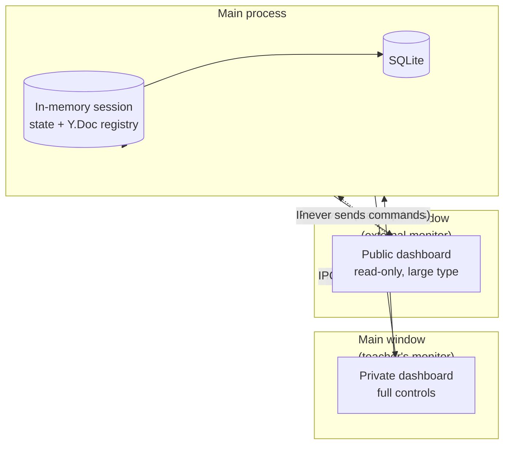

# OfflineClass — Architecture

Companion to `docs/features.md` (what the product does). This doc captures **how** it is built — system shape, data flows, technology choices, and the threat model.

## Status

The original POC lives on branch `poc/electron-monorepo` and is treated as throwaway scaffolding. This document describes the **target architecture** for the rewrite, consolidating decisions made in the design discussions of 2026-05-25 and 2026-05-26. Decisions explicitly deferred are flagged inline.

The rewrite begins on a new branch (`rewrite/v1`, branched from `main`) once `docs/features.md` and this document are reviewed and the GitHub backlog is populated.

---

## Goals & non-goals

### Goals

- **Offline-first.** The desktop app boots and operates without internet. The LAN-only classroom flow (teacher's desktop ↔ student PCs over Wi-Fi) is the primary operational mode.
- **Live collaboration.** When a session is in group mode, members of a group see each other's cursors, presence, and answer edits in real time — Tiptap-like awareness.
- **Optional cloud sync.** Teachers can opt in to back up exam definitions and upload session results to a self-hosted VPS, but sync is never required at runtime.
- **PC-only by design.** The student experience is built for desktop browsers on the classroom LAN. Smartphones and mobile data fall outside the threat boundary that anti-cheat depends on.
- **Single-binary distribution.** The desktop ships as one installer per OS (Windows `.exe`, macOS `.dmg`, Linux `.AppImage`) with no external services to set up locally.
- **TypeScript everywhere.** One language across desktop, student SPA, and cloud — shared Zod schemas validate the wire format on both sides of every boundary.

### Non-goals

- Cross-classroom student accounts. Students are ephemeral per-session identities; no persistent student database is shipped.
- Mobile or tablet support for the student experience.
- Authoring on the web. All prova creation happens on the desktop; the cloud only receives definitions, never edits them.
- Real-time collaboration over the public internet. Yjs is a LAN-only mechanism in this architecture.
- Live grade publishing across the internet. Result delivery to students is via email, not a public web portal.

---

## System overview



Solid lines are always-on within the classroom session. Dotted lines are opt-in and triggered manually by the teacher.

---

## Monorepo layout

```
OfflineClass/
├── apps/
│   ├── desktop/          # Electron app (teacher's machine)
│   ├── student-web/      # Vite SPA served by desktop's Hono over LAN
│   └── cloud/            # Hono + Drizzle + Postgres backend on the VPS
├── packages/
│   └── shared/           # Zod schemas and shared DTOs
├── docs/
│   ├── architecture.md
│   └── features.md
├── scripts/              # Dev/CI scripts
├── pnpm-workspace.yaml
└── package.json
```

- **One `pnpm install`** at the root resolves all three apps and the shared package.
- **`packages/shared`** is the only cross-app dependency. It holds:
  - Zod schemas validated on both ends of every wire (IPC, LAN HTTP, Yjs payloads, cloud sync DTOs).
  - Schemas and types used across the desktop and student apps.
  - Pure types and small utilities (`safeJsonParse`, etc.).
- **No `packages/ui`.** Each app owns its own shadcn components per the POC's experience — sharing UI components produced more friction than reuse when only two apps consume them.

---

## Components

### `apps/desktop` (Electron + TypeScript)

The teacher's machine. Three logical surfaces in one binary.

1. **Electron main process** — owns the SQLite database, mDNS broadcast, HTTPS LAN server (Hono + `@hono/node-ws`), the cloud sync worker, and the self-signed TLS cert. Spawns and manages two `BrowserWindow`s (main + projector).
2. **Electron renderer (teacher UI)** — React 19 + Tailwind v4 + shadcn (radix-nova preset) + TanStack Query + react-router-dom (HashRouter). Talks to main exclusively via the **IPC bridge** (`ipcMain.handle` / `contextBridge`). Has no network access of its own.
3. **Projector window (renderer)** — separate `BrowserWindow` reading the same in-memory session state from main via IPC. Always read-only — never sends commands.

```
apps/desktop/
├── src/
│   ├── main/
│   │   ├── index.ts                  # app.whenReady() boot
│   │   ├── db/
│   │   │   ├── client.ts             # better-sqlite3 + Drizzle
│   │   │   ├── schema.ts             # all tables + relations
│   │   │   └── migrations/           # generated by drizzle-kit
│   │   ├── auth/
│   │   │   ├── teachers.ts           # bcrypt + session tokens (local)
│   │   │   └── cloud-link.ts         # long-lived token for cloud
│   │   ├── server/                   # Hono LAN server + WebSocket
│   │   │   ├── index.ts              # startServer(port, deps) — attaches WebSocket to Node httpServer
│   │   │   ├── routes/               # /api/health, /api/join, /api/answers, …
│   │   │   └── socket/
│   │   │       ├── index.ts          # io = new Server(httpServer, cors/auth opts)
│   │   │       ├── auth.ts           # handshake middleware (token → student + session)
│   │   │       ├── rooms.ts          # room name helpers: session:<id>, group:<id>, teacher:<id>
│   │   │       ├── events.ts         # typed event map (ServerToClient / ClientToServer)
│   │   │       └── handlers/
│   │   │           ├── session.ts    # lobby/start/end lifecycle pushes
│   │   │           ├── group.ts      # group-join/leave, submit flow
│   │   │           └── awareness.ts  # cursor/presence forwarding inside group room
│   │   ├── crdt/
│   │   │   ├── docs.ts               # in-memory Y.Doc registry per group
│   │   │   ├── snapshots.ts          # periodic SQLite BLOB persistence
│   │   │   └── extract.ts            # Y.Doc → group_answers at submit time
│   │   ├── sessions/
│   │   │   ├── store.ts              # session CRUD + state machine
│   │   │   └── groups.ts             # group lifecycle
│   │   ├── sync/                     # cloud sync worker
│   │   │   ├── client.ts             # HTTP client w/ token
│   │   │   ├── definitions.ts        # push/pull provas
│   │   │   └── results.ts            # push results + email request
│   │   ├── discovery/
│   │   │   ├── mdns.ts
│   │   │   └── qr.ts
│   │   ├── tls/                      # self-signed cert generation
│   │   ├── ipc/                      # ipcMain.handle handlers (teacher endpoints)
│   │   └── windows/                  # main window + projector window factory
│   ├── renderer/                     # teacher UI (React)
│   │   ├── src/
│   │   │   ├── App.tsx
│   │   │   ├── routes/               # HashRouter routes
│   │   │   ├── components/
│   │   │   └── lib/                  # IPC client, hooks
│   │   └── index.html
│   ├── projector/                    # second BrowserWindow's renderer
│   └── preload/                      # contextBridge — typed IPC surface
├── electron.vite.config.ts
└── package.json
```

### `apps/student-web` (Vite + React)

Pure SPA. Served by the desktop's Hono server over LAN (HTTPS). Loads in a PC browser when the student types the URL or scans the QR.

- React 19 + Tailwind v4 + shadcn (radix-nova preset) + react-router-dom (HashRouter)
- Yjs client (`yjs` + `y-protocols/awareness`) utilizing native HTML5 WebSockets over `/api/ws`
- Tiptap for the essay/code editor with `@tiptap/extension-collaboration` and `@tiptap/extension-collaboration-cursor` bound to the shared `Y.Doc`
- `react-nice-avatar` (or equivalent SVG generative avatar) for the lobby
- TanStack Query for HTTP calls (`/api/join`, `/api/heartbeat`, `/api/answers`)
- No build-time backend coupling: the SPA is statically served and discovers the backend by virtue of being served from it (same origin)

### `apps/cloud` (optional cloud-sync tier — planned via PowerSync)

> **Status:** not in the repo. The earlier apresenta-derived `apps/cloud` clone was deleted,
> and the sync tier will be implemented with **PowerSync** rather than the hand-rolled
> sync_outbox / LWW design described below. PowerSync handles replication, conflict
> resolution, and the local-to-remote bridge itself, so the implementation will reduce to a
> source DB (Postgres), the PowerSync service, and a thin auth-token + write-upload connector.
> The sections below are kept as the original product intent and will be revised when that
> work starts.

The VPS-hosted backend. Receives definitions + results, sends email. Never speaks Yjs.

```
apps/cloud/
├── src/
│   ├── index.ts                      # Hono server bootstrap
│   ├── db/
│   │   ├── client.ts                 # Drizzle + pg
│   │   ├── schema.ts                 # cloud schema (often mirrors desktop)
│   │   └── migrations/
│   ├── auth/
│   │   ├── teachers.ts               # bcrypt + JWT
│   │   └── middleware.ts             # Bearer extraction + verify
│   ├── routes/
│   │   ├── auth.ts                   # POST /auth/register, /auth/login, /auth/revoke
│   │   ├── sync-provas.ts            # POST/GET /api/sync/provas
│   │   ├── sync-results.ts           # POST /api/sync/sessions/results
│   │   ├── email-results.ts          # POST /api/sync/sessions/results/email
│   │   └── health.ts
│   └── email/
│       ├── provider.ts               # interface (Resend/Mailgun/SendGrid behind it)
│       └── queue.ts                  # retry + DLQ
├── Dockerfile
├── docker-compose.dev.yaml           # cloud + postgres for local dev
└── package.json
```

### `packages/shared`

```
packages/shared/
├── src/
│   ├── index.ts
│   └── schemas.ts                    # Zod schemas for auth, exams, questions, sessions, groups, and gameplay
└── package.json
```

---

## Data flow & boundaries

Three protocols, three audiences, three threat zones.

| Protocol | Endpoint | Audience | Authentication | Auth scope |
|---|---|---|---|---|
| **Electron IPC** | `ipcMain.handle('teacher.*', …)` | Teacher renderer ← → main process | Implicit (same OS process; preload uses `contextBridge`) | Local teacher actions only |
| **HTTPS (LAN)** | `https://<lan-ip>:8000/api/*` | Student PC → desktop server | Bearer token from `/api/join` | Student-scoped operations |
| **WebSocket (LAN)** | `wss://<lan-ip>:8000/api/ws` | Student PCs ↔ desktop server | Bearer token passed as query param — validated on handshake | Single authenticated socket per student; mapped to session and group context |
| **HTTPS (cloud)** | `https://cloud.example/api/*` | Desktop → VPS | Long-lived Bearer (linked teacher) | Per-teacher cloud account |

The split is enforced **by topology**, not by middleware:

- Teacher endpoints (prova CRUD, session lifecycle, grading) **exist only as IPC handlers**. They have no HTTP route on the LAN server. A student on the LAN cannot impersonate the teacher because the API surface for teacher actions is unreachable from outside the Electron process.
- The cloud backend never speaks Yjs and never serves the student SPA. Its only consumers are linked teacher desktops.
- The student SPA never directly contacts the cloud — only the desktop does.

### WebSocket rooms topology

All real-time communication — session lifecycle events, group collaboration, and awareness — flows through native WebSockets served via Hono's `@hono/node-ws` upgrade handler at `/api/ws`. An in-memory registry (`Rooms` in `rooms.ts`) manages active socket subscriptions and room mapping.

```
Room / Subscription  Who joins                           What flows through it
─────────────────────────────────────────────────────────────────────────────
Session Context      Every student after /api/join       session.started
                     and teacher sockets                 session.ended
                                                         student.submitted / student.left

Group Context        Members of that group after         yjs:update  (CRDT binary)
                     group assignment                    yjs:awareness (presence binary)
                                                         group.submit.* events (confirm, cancel, waiting, success)

Teacher Context      Teacher sockets                     session.lobby.update
```

Authentication happens when establishing the WebSocket connection: the client passes the token as a query parameter (`token=...`); the server validates the token, associates the socket with the student and session/group, and closes the connection with code 4001 if unauthorized. Subscriptions and group mapping are managed entirely server-side; the client has no control over which rooms it joins.

---

## Data model

### Desktop SQLite (source of truth, local)

Tables (overview — full DDL lives in `apps/desktop/src/main/db/schema.ts`):

```
teachers                  id, email, name, passwordHash, createdAt
teacher_sessions          id, teacherId, token, createdAt, expiresAt

exams                     id, ownerId, title, description, subject, gradeLevel, icon, createdAt, updatedAt
questions                 id, examId, position, kind, prompt, points, optionsJson, image, answerBool, language, starterCode
                          # kind enum: 'mcq' | 'multi' | 'truefalse' | 'essay' | 'code'
                          # image stores an optional attached inline image (data URL)
                          # optionsJson stores the choices array for mcq/multi

exam_sessions             id, examId, ownerId, status, durationMinutes, allowLateJoin, scrambleQuestions,
                          scrambleOptions, groupMode, maxGroupSize, startedAt, endedAt, createdAt
                          # groupMode enum: 'disabled' | 'free' | 'teacher' | 'shuffle'

students                  id, sessionId, name, matricula, token, joinedAt, lastSeenAt, submittedAt, leftAt
answers                   id, studentId, questionId, value, updatedBy, score, updatedAt
                          # value holds the student answer or Yjs JSON state representation
                          # updatedBy tracks which group member last modified this answer

groups                    id, sessionId, name, createdAt
group_members             id, groupId, studentId, joinedAt
group_yjs_snapshots       groupId, snapshot (BLOB/Buffer), createdAt, updatedAt
                          # Y.Doc binary snapshot stored to resume session state on restart
```

> [!NOTE]
> The target schema includes `cloud_link`, `sync_outbox`, and `materials` tables to support cloud backup, synchronization, and local media attachments (PDFs/videos). These tables are not implemented in the current local SQLite schema. Similarly, `group_answers` is not implemented as group answers are written directly to the `answers` table.

### Cloud Postgres

Mirrors the desktop schema for syncable entities (`provas`, `questions`, `materials` — materials only as references, files don't sync — `exam_sessions`, `groups`, `group_members`, `students`, `group_answers`) plus its own:

```
cloud_users               id, name, email, passwordHash, createdAt
cloud_tokens              id, userId, token, kind (access|refresh), expiresAt
email_queue               id, recipientEmail, recipientName, payload (JSON), status, attempts, lastError, sentAt
```

Cloud rows have the same `id`, `updatedAt`, `deletedAt` columns as the desktop side — that's what makes LWW work.

### ID strategy

The current implementation uses standard **UUID v4** (generated via Node's `randomUUID()` on the Electron main process) for all database tables and entities. 

While **ULID** remains the target ID strategy for a distributed, multi-tenant cloud sync architecture (due to time-ordering and index locality on Postgres), UUID v4 is fully sufficient for the single-tenant local LAN server deployment.

### Hard delete + Cascade (Current Implementation)

- The current offline schema relies on standard SQL hard deletes with cascade constraints (`onDelete: 'cascade'`) to maintain referential integrity.
- **Soft delete + LWW (Last-Write-Wins)** using `deletedAt` and `updatedAt` is the target design for cloud sync integration to ensure correct replication and conflict resolution across multiple synced devices.

---

## Identity & auth

Three identities, three lifetimes.



- **Local teacher** — created in the desktop app via a registration screen. Multi-teacher per install supported (separate accounts share the same SQLite DB; rows scope to `ownerId`). Session token persists across app restarts via SQLite + Electron `safeStorage`.
- **Cloud teacher** — registered (in-app modal, **deferred decision** in features §10) and linked to a local teacher via the "Sync" flow. Long-lived access token stored encrypted on disk. A single cloud account can be linked from multiple desktops (laptop + classroom PC) — both push to the same upstream.
- **Student** — ephemeral identity created at `POST /api/join` (name + matrícula + email). Token is valid only for the session that minted it; expires when the session transitions to `ended`. No persistent `students` table across sessions.

### Threat boundary

- The teacher's renderer never sees a cloud token directly — the main process holds it and uses it on the renderer's behalf.
- Student tokens can answer only for their own session; the desktop validates `student.sessionId === activeSession.id` on every write.
- The cloud server never trusts data without verifying the linked teacher's token (`ownerId` on every row must match the authed teacher).

---

## Real-time collaboration (Yjs)

### Why Yjs

A "group" in OfflineClass is a small set of students working together on the same answer set. They need:

- Live answer state shared across members (MCQ select, ordering drag, code typing, essay text)
- Cursor + selection awareness, especially for essay/code editing
- Reconnection without losing in-progress edits
- Conflict resolution when two members edit at the same time

These are exactly the primitives Yjs was built for. The Yjs CRDT layer is transport-agnostic; native WebSockets (served via Hono's `@hono/node-ws` upgrade handler at `/api/ws`) provide the transport channel for the student clients. The WebSocket connection handles both session events (JSON) and collaborative CRDT/awareness updates (Uint8Array binary buffers differentiated by a single-byte type prefix: type 0 for Yjs document updates and type 1 for awareness protocol updates).

### Y.Doc shape per group

```
group:<groupId>           (the Y.Doc)
├── answers (Y.Map<questionId, Y.Map>)
│   ├── q1 → { value: "C", updatedBy: "stud_abc", updatedAt: 1716742800 }   (MCQ)
│   ├── q2 → { value: Y.Text(...), updatedBy: "stud_xyz", updatedAt: …  }   (essay/code)
│   ├── q3 → { value: ["B", "C"], updatedBy: …, … }                         (multi-select)
│   └── …
├── status (Y.Map)
│   ├── submittedAt → ?
│   └── submittedBy → ?
└── awareness (separate Awareness instance, transient)
    └── stud_abc → { cursor: { qId, pos }, selection, avatarConfig, displayName }
```

### Server role: relay only

The desktop server manages room subscriptions and relays Yjs updates. The Hono server:

1. Authenticates the connection inside the `/api/ws` upgrade middleware (token validation and group membership lookup) before registering the client in the `Rooms` subscription list.
2. Relays incoming binary updates (`type 0` and `type 1`) to every other socket in the same group room via `Rooms.broadcastYjsToGroup`.
3. Maintains an in-memory `Y.Doc` per active group inside the `yjsManager` process.
4. Periodically writes the serialized state update snapshot to the SQLite `group_yjs_snapshots` table (BLOB) — debounced by 2 seconds after any document write.
5. On document updates, the `yjsManager` automatically synchronization flushes the answers from the Y.Doc's `'answers'` map back into the SQLite `answers` table so the teacher can grade them.

The server **never rejects or transforms** Yjs updates. All validation happens at the connection boundary; once you're in the room, you can edit anything in the doc.

### Yjs collab flow



### Awareness

Separate from the persisted CRDT state. The `awareness` instance carries each member's transient presence: which question they're focused on, where their cursor is in an essay, and their display name. Awareness updates travel as binary `type 1` websocket frames inside the group room. Lost on socket close, recreated on reconnect — socket closure triggers immediate removal from the `Rooms` registry.

### Submission (unified group submission)

Submission is a coordinated operation across all members of the group. It is **not** a Yjs operation — it's a server-mediated state transition triggered via HTTP:

1. Any group member POSTs to `/api/submit`.
2. The server:
   - Flushes the Yjs snapshot to SQLite immediately via `yjsManager.flushPendingSave`.
   - Locates all sibling student records belonging to the same group.
   - Marks all sibling records as submitted (`submittedAt` set to now) and notifies the teacher and all members over the WebSocket connection (`student.submitted`).
   - Extracts each `answers[qId].value` and writes one `group_answers` row per question.
   - Marks the group as submitted in SQLite.
   - Calls `io.in('group:<groupId>').disconnectSockets()` (no more edits).
   - Emits `group.submitted` to the `session:<sessionId>` room for the teacher's dashboard.

4. **Members who go offline during confirmation** are automatically removed from the room; the server's `disconnect` handler drops them from `awaitingFrom` — they don't block. If everyone except the initiator disconnects, the initiator's own confirmation is enough.

5. **Members offline at initiation time** are simply not in the room at step 1 — they don't block submission.

Submitted state is irreversible. The Y.Doc is kept (for audit / projector replay) but no new updates are accepted.

---

## Cloud sync

### UX model

- Default state on first install: **"stay local" = ON** (sync hidden entirely, offline-first).
- Teacher turns the toggle off → header sync indicator appears, prompts to link a cloud account.
- After linking, the header shows: `synced`, `N pending`, `syncing…`, or `error`. Clicking it triggers a sync round.
- A "session results ready" notification appears in the header when a session ends, prompting the teacher to push.

### Sync round



### What syncs

- ✅ Prova definitions + question blocks (JSON)
- ✅ Material *references* (the rows, not the files)
- ✅ Session metadata + final results (group_answers, scores, comments)
- ✅ Soft-deletes (propagated via `deletedAt`)
- ❌ Material files (PDFs, videos, images) — local-only by design
- ❌ Y.Doc snapshots — LAN-only
- ❌ Awareness / presence — transient by definition
- ❌ Active session state (sessions are LAN-only until they end)

### Email results

After results push, the teacher can click "Email results". The desktop POSTs `/api/sync/sessions/results/email` to the cloud with the list of `(email, payload)` tuples. The cloud enqueues sends through its configured email provider (provider choice deferred). Failures retry with backoff; surface failures back to the desktop on the next sync round.

---

## Session lifecycle



**Single-active-session per teacher** — the desktop refuses to start a new session if the teacher already owns one in `lobby` or `running`. The active session is reachable from the dashboard regardless of which tab the teacher is on.

---

## Group lifecycle

Three formation modes, one resulting state.



If `group_mode = free` and a student remains without a group when the teacher starts the session, that student is **blocked from entering `running`** until they either create or join a group (a solo group of 1 is valid). The teacher can see who's still ungrouped on the private dashboard. The session as a whole can still transition to `running` for everyone else; the blocked student stays in a "fora da sessão" state until they pick a group.

---

## Discovery & networking

- **mDNS** publishes `offlineclass._http._tcp.local` (port 8000) via `bonjour-service` on `app.whenReady()`. Also publishes an A record for `offlineclass.local` for devices that resolve the FQDN.
- **QR code** rendered in the teacher's debug panel with the full URL: `https://<resolved-IP>:<port>`. Students whose browsers don't resolve `.local` use the QR (or type the URL).
- **TLS** — a self-signed cert is generated on first boot and persisted under `userData/tls/`. The student sees a "Your connection is not private" warning the first time and accepts it manually (deferred whether to ship a pre-installable CA cert).
- **Bind address** — `0.0.0.0:8000` (all interfaces). Multi-interface IP resolution (Wi-Fi + Ethernet) is a TBD in features §10.

---

## Two-window Electron architecture



- The main window is the only one that can issue commands (start session, end session, send email, etc.).
- The projector window subscribes to the same IPC event stream but the preload script exposes a strictly read-only surface (no `invoke`, only `on`).
- Closing the projector window does **not** affect the session — it can be reopened from the main window's header at any time.

---

## Build, dev, distribution

### Local dev

```
pnpm install            # one install for all three apps
pnpm --filter @offlineclass/desktop dev       # Electron with HMR
pnpm --filter @offlineclass/student-web dev   # Vite dev server (mostly for SPA dev — production loads via desktop)
pnpm --filter @offlineclass/cloud dev         # Hono dev server + postgres via docker-compose
```

`scripts/dev.sh` orchestrates the common combo (cloud's docker-compose + desktop + student-web watcher).

### Build

- Desktop: `electron-vite build` produces main, preload, and renderer bundles; `electron-builder` wraps them.
- Student-web: `vite build` produces a static bundle. Desktop's packaging step copies it into the asar resources directory; the Hono server's static handler resolves to it at runtime.
- Cloud: `tsc` to `dist/` + a single-stage Dockerfile (`node:22-alpine` runtime).

### Migrations

- Both desktop and cloud generate Drizzle migrations via `drizzle-kit generate`. Migrations live alongside their respective schemas (`apps/desktop/src/main/db/migrations/`, `apps/cloud/src/db/migrations/`).
- Desktop applies migrations in `app.whenReady` before opening any window. Cloud applies migrations on container start (`migrate.ts` invoked by the entrypoint).

### Distribution

- **Desktop:** `electron-builder` outputs `.exe` (Windows), `.dmg` (macOS), `.AppImage` (Linux). Code signing deferred (TCC scope skips it; institutional rollout would add it).
- **Cloud:** Docker image pushed to the VPS. Compose file on the VPS includes Postgres + the cloud container. TLS termination strategy deferred (reverse proxy vs Hono direct).

---

## Threat model

The architecture is built around **trust by topology**, not middleware.

| Zone | Trust | Reachable from |
|---|---|---|
| Electron main process | Full | Local OS only |
| Teacher renderer | Full (via IPC) | Local OS only (Chromium sandbox, no external network access by design) |
| LAN HTTP / WS / Yjs surface | Untrusted, scoped | Any device on the classroom Wi-Fi |
| Cloud HTTP surface | Bearer-authenticated per teacher | Public internet |

### Anti-cheat baseline

- **Smartphone exclusion.** The student SPA is engineered for PC viewports; we don't bundle a touch-optimized UI. A smartphone *could* technically render the SPA, but combined with the operational policy of "students use the lab PCs", this discourages the mobile-data bypass attack.
- **LAN-only collab.** Yjs channels are not reachable from the public internet — a student would need to be on the classroom Wi-Fi to even see the session.
- **No fullscreen lock / no tab detection.** Web APIs for this are weak (easy to bypass with dev tools) and give a false sense of security. Anti-cheat is a policy + topology question, not a JavaScript one.
- **Session-scoped student tokens.** A student can't replay another session's token; tokens are bound to a specific `sessionId` and reject mismatched writes.

### Untrusted boundaries

- Every incoming HTTP body validated by a Zod schema before touching the DB.
- Every WebSocket connection is authenticated during the handshake in the upgrade middleware (token parameter → student + session). The socket is rejected and closed if validation fails.
- Group access is enforced entirely server-side: the `Rooms` manager maps the student socket to their group context. Clients have no direct room joining capability.
- Every cloud-bound payload validated server-side with the same schemas the desktop validates client-side (shared via `packages/shared`).

---

## Implementation phases

Each phase ends with a buildable commit. Cloud and desktop can be developed in parallel from Phase 2 onward (no shared runtime dependency until Phase 8).

| Phase | Scope | Buildable deliverable |
|---|---|---|
| **0** | Monorepo skeleton | `pnpm-workspace.yaml`, `tsconfig.base.json`, `packages/shared` with initial Zod schemas |
| **1** | `apps/cloud` bootstrap | Hono + Drizzle + Postgres (docker-compose dev), teacher auth (register/login), `/api/health` |
| **2** | `apps/desktop` foundation | electron-vite scaffold, SQLite + Drizzle, local teacher auth, IPC bridge, Hono LAN with `/api/health` |
| **3** | Desktop domain core | Schema (`exams`, `questions`) with UUID + hard delete, IPC CRUD, form builder UI shell, mDNS + QR + TLS |
| **4** | `apps/student-web` | create-vite + shadcn radix-nova, join flow (name/matrícula/email), avatar customizer, lobby |
| **5** | Groups + lobby | `groups` + `group_members`, three formation modes, UI on both sides |
| **6** | WebSockets + Yjs collaboration | Native WebSockets attached to Hono's Node server, `Rooms` topology, native WebSocket provider, Y.Doc per group, awareness/cursors, snapshot persistence |
| **7** | Session lifecycle | start/end transitions, Y.Doc → `group_answers` extraction on submit, dashboard live view |
| **8** | Cloud sync (definitions) | Sync UI in header, link cloud, push/pull with LWW, soft-delete propagation |
| **9** | Cloud sync (results + email) | Push results after `ended`, email-results flow via cloud's email module |
| **10** | Packaging | electron-builder for desktop, Dockerfile + compose for cloud |

Each phase maps to a milestone in the GitHub backlog. Issues are labeled by `area:` (cloud / desktop / student-web / shared) and `phase:` (0..10).

---

## Stack reference

| Concern | Choice | Reason |
|---|---|---|
| Language | TypeScript everywhere | Single language across desktop, SPA, cloud; shared schemas via `packages/shared` |
| Package manager | pnpm workspaces | Monorepo support, content-addressable store, fast |
| Desktop framework | Electron via `electron-vite` | Cross-platform, mature, supports Node + Chromium in one binary |
| Frontend framework | React 19 | Most widely supported; matches POC validation |
| Styling | Tailwind v4 + shadcn (radix-nova) | POC-validated; per-app shadcn (no shared `packages/ui`) |
| Routing | react-router-dom (HashRouter) | Works inside Electron without server-side routing; POC-validated |
| Server (desktop + cloud) | Hono | Tiny, web-standards-based, runs on Node and Bun if needed |
| Real-time transport | WebSocket (`@hono/node-ws` / browser WebSocket) | Unified channel for session events, awareness, and Yjs updates; in-memory `Rooms` registry for fan-out |
| Real-time collab | Yjs + native WebSocket + `y-protocols/awareness` | CRDT + presence over native WebSocket; Hono upgrade route at `/api/ws` |
| Rich editor | Tiptap + `extension-collaboration` + `extension-collaboration-cursor` | Plugs into the shared Y.Doc; collaborative caret positioning |
| Local DB | better-sqlite3 + Drizzle | Synchronous SQLite on the main process; Drizzle for typed migrations |
| Cloud DB | Postgres + Drizzle | Mirrors desktop's ORM; same migration tooling |
| Schemas | Zod (in `packages/shared`) | Validates wire format on both ends of every boundary (HTTP inputs, WS messages) |
| IDs | UUID v4 via `randomUUID()` | Generated on desktop main process |
| Avatars | `react-nice-avatar`-style generative SVG | No image storage, customizable, renderable everywhere |
| Discovery | `bonjour-service` (mDNS) + `qrcode` | POC-validated |
| TLS | Self-signed cert generated on first boot | LAN context; manual cert accept on student browsers |
| Email (cloud) | Provider TBD (Resend / SendGrid / Mailgun / Postmark / SMTP) | Deferred; module designed as an interface to swap |
| Auth (local teacher) | bcrypt + persistent session token | POC-validated |
| Auth (cloud teacher) | JWT (access) + opaque refresh token | Industry standard for stateful refresh |
| Packaging | electron-builder | Cross-platform installers; POC validated |

---

## Open architectural questions

These are decisions deferred either pending team input or because they don't block other work. They live in `docs/features.md` §10 — listed here only for the architecturally-significant ones:

1. **Email provider choice** (deferred to team). Module is designed behind an interface, so the cloud can ship without a concrete provider and add one later without API change.
2. **Cloud TLS termination strategy** — Hono direct, or behind nginx/caddy/Cloudflare. Probably nginx for cert renewal via certbot, but deferred until deploy phase.
3. **CA cert distribution to student PCs** — manual accept on first connect is acceptable for TCC scope; a pre-installable CA bundle would polish the experience for institutional rollout.
4. **Auxiliary materials file size limits** — primarily a UX-cushion decision (large PDFs hurt LAN response time) rather than a correctness one.
5. **Multi-network handling** — which IP wins in the QR when the desktop has both Wi-Fi and Ethernet active. Probably pick the interface bound to the default route; defer until needed.
