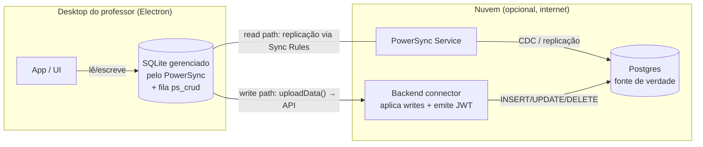

# Arquitetura-alvo de sync com PowerSync

> Descreve **como** o sync funciona com PowerSync (D-101). Decisões D-107..D-111 estão
> registradas em [`decisions.md`](./decisions.md). Base factual: [`inventory.md`](./inventory.md).
>
> **Atualizado em 2026-06-30** para refletir Sync Streams (D-110), Opção B bridge (D-107),
> novo app `apps/sync` (D-111) e stack do connector (D-108).
>
> Fonte do modelo PowerSync: docs oficiais (https://docs.powersync.com), auditados em
> 2026-06-29/30.

---

## 1. Modelo do PowerSync (como o produto realmente funciona)

PowerSync é um motor de sync **server-authoritative** entre um banco de origem
(aqui: **Postgres**) e um SQLite gerenciado no cliente.

**Dois caminhos, fonte de verdade no servidor:**

| Caminho | Direção | Quem executa | Mecanismo |
|---------|---------|--------------|-----------|
| **Read** (pull) | Postgres → cliente | PowerSync Service | Replica o Postgres para o SQLite do cliente conforme as **Sync Rules** ativas |
| **Write** (push) | cliente → Postgres | Connector definido por nós | Toda escrita no SQLite vai para a fila `ps_crud`; o SDK chama `uploadData()`, que envia ao **backend connector**, que aplica no Postgres de forma **síncrona** |

Consistência: o cliente avança um **write checkpoint** após o upload. Se o próximo
checkpoint não contiver as mudanças enviadas, o cliente as descarta localmente (daí o
backend ter que aplicar de forma síncrona). PowerSync cuida de retries, ordem FIFO e
persistência da fila entre reinícios/quedas de rede — é exatamente o que dá o comportamento
offline-first.

> **Implicação central:** o Postgres é a fonte de verdade de escrita. Hoje o
> `better-sqlite3` + Drizzle (`offlineclass.db`) é a fonte de verdade local (ver
> `inventory.md`). Como esses dois mundos convivem é a decisão **❓ Q-201** — leia antes de
> implementar.

---

## 2. Peças a construir

| Peça | Onde | O que faz | Status |
|------|------|-----------|--------|
| **Postgres na nuvem** | `apps/sync/powersync/docker/` (Docker Compose CLI) | Fonte de verdade dos dados sincronizáveis | ✅ criado (Fase 1) |
| **PowerSync Service** | `apps/sync/powersync/` (self-host, CLI `powersync docker start`) | Replica Postgres → clientes via **Sync Streams** (D-110) | ✅ criado (Fase 1) |
| **Backend connector** | `apps/sync/src/` (Hono + Drizzle + `postgres-js` — D-108) | Recebe `uploadData()`, valida (Zod via `packages/shared`), aplica no Postgres; emite JWT de sync | ✅ criado (Fase 2) |
| **Bridge isolado** | `apps/desktop/src/main/sync/bridge.ts` (D-107 Opção B) | Espelha `offlineclass.db` ↔ SQLite gerenciado do PowerSync por reconciliação-diff; nunca toca regra de negócio | ✅ criado (Fase 4) |
| **Cliente PowerSync no desktop** | `apps/desktop/src/main/sync/` | `@powersync/node` (driver `better-sqlite3`); define `uploadData()`; `connect()` | ✅ criado (Fase 3) |
| **Sync Streams config** | `apps/sync/powersync/sync-config.yaml` (`edition: 3`) | Escopam dados por `owner_id = auth.user_id()` com JOIN para questões/respostas | ✅ criado (Fase 1) |
| **Schema Postgres** | `apps/sync/src/schema.ts` | Espelha tabelas sincronizáveis; mesmos UUIDs v4 | ✅ criado (Fase 1) |
| **Auth/vínculo cloud** | `apps/desktop` + connector | Login/registro cloud; JWT de sync por professor | ✅ criado (Fase 3; ❓ Q-202 detalha multi-dispositivo) |
| **UI: toggle stay-local + indicador** | renderer do desktop (Settings + sidebar badge) | Liga sync e mostra status (synced / pending / syncing / error) | ✅ criado (Fase 7 — Variante B) |
| **Resultados no sync** | bridge + Sync Streams + schema | `exam_sessions`/`students`/`answers`/`score` no pipeline | ✅ criado (Fase 6) |
| **Validação ponta a ponta** | local | Push real → Postgres → pull via 2º cliente | 🟡 pendente (Fase 5) |

---

## 3. O que sincroniza (mapa para os 3 entregáveis)

| Entregável | Entidades | Direção |
|------------|-----------|---------|
| Sincronizar provas | `exams`, `questions` | push + pull |
| Sincronizar resultados | `exam_sessions`, `students`, `answers` (respostas + `score`) | push (+ pull p/ "versão mais recente") |
| Buscar versão mais recente | todas as acima | pull (read path do PowerSync) |

**Não sincroniza:** `teachers`/`teacher_sessions` (auth local; ❓ Q-202 trata da relação com
auth cloud), estado de sessão ao vivo (LAN-only até encerrar), e nada de grupos/Yjs/materiais
(fora do escopo — `scope.md`).

> ❓ **Q-204 — soft-delete:** hoje `exams.delete` é hard delete e não há coluna `deletedAt`
> (ver `inventory.md`). Propagar deleções pelo sync normalmente exige soft-delete. Decidir
> se entra `deletedAt` (e em quais tabelas) ou se deleção fica fora do sync nesta branch.

---

## 4. Schema Postgres (a desenhar a partir do SQLite atual)

Princípio: o Postgres **espelha** as tabelas sincronizáveis do SQLite (mesmos `id` UUID,
mesmos campos), com escopo por `ownerId`/conta cloud nas Sync Rules. As tabelas-base estão
auditadas em [`inventory.md`](./inventory.md) — o desenho detalhado do DDL Postgres e das
Sync Rules é tarefa da fase de design da nuvem (ver `implementation-plan.md`).

Pontos a resolver no desenho (todos em `open-questions.md`):

- **Tipos de coluna** (ex.: `optionsJson`/`image`/`value` como `jsonb`/`text`).
- **Chave de tenant** para as Sync Rules: `ownerId` local vs `cloudUserId` (❓ Q-202).
- **Mapeamento `students`/`answers`** → quanto dos resultados sobe (PII de aluno: nome,
  matrícula). ❓ Q-205.

---

## 5. Fluxos

### 5.1 Push de uma prova (cliente → nuvem)

1. Professor edita/cria a prova localmente (regra de negócio atual, **inalterada**).
2. A escrita chega ao SQLite gerenciado pelo PowerSync → entra na fila `ps_crud` (PUT/PATCH/DELETE).
3. SDK chama `uploadData()` → POST para o backend connector com o lote de operações.
4. Backend valida (Zod, schemas em `packages/shared`) e aplica no Postgres de forma síncrona.
5. PowerSync Service observa a mudança no Postgres e confirma via checkpoint.

### 5.2 Pull "versão mais recente" (nuvem → cliente)

1. Cliente `connect()` ao PowerSync Service com JWT do professor.
2. Service replica, conforme as Sync Rules do professor, as linhas mais novas do Postgres
   para o SQLite gerenciado.
3. A UI lê do SQLite gerenciado e mostra a versão mais recente (inclusive em um 2º PC).

### 5.3 Resultados de sessão

Após uma sessão encerrar (`status = ended`), os resultados (`exam_sessions` + `students` +
`answers`/`score`) seguem o mesmo push da §5.1. ❓ Q-205 decide o recorte de dados do aluno.

---

## 6. Convivência com o DB atual — Decisão: Opção B (bridge) ✅ D-107

O app lê/escreve direto no `better-sqlite3` via Drizzle (`offlineclass.db`) — essa camada
é **inalterada**. O cliente PowerSync abre um **SQLite separado** (`userData/powersync.db`).
Um módulo bridge isolado (`apps/desktop/src/main/sync/bridge.ts`) sincroniza os dois:

- **Push (local → managed):** lê `exams`/`questions` do `offlineclass.db` (read-only), faz
  diff por conteúdo contra o DB gerenciado, emite INSERT/UPDATE/DELETE no DB gerenciado.
  Os DELETEs propagam os hard deletes atuais sem precisar de `deletedAt` (D-109).
- **Pull (managed → local):** lê tabelas gerenciadas replicadas do Postgres, aplica upsert/delete
  no `offlineclass.db` via Drizzle existente — UI vê a versão mais recente sem mudança de IPC.
- **Anti-loop:** o bridge usa um flag/hash para distinguir mudanças originadas localmente de
  mudanças chegadas do pull, evitando loops de eco.
- **Disparo:** manual (botão de sync) ou em foco no app; **nunca** durante runtime de sala LAN.

| Opção avaliada | Status | Motivo |
|----------------|--------|--------|
| A — PowerSync vira o DB local | Descartada | Mexe em toda a camada de dados — risco alto em regra de negócio |
| **B — bridge isolado** | **Escolhida (D-107)** | Isola completamente o sync; nenhuma regra de negócio muda |
| C — dois caminhos incrementais | Descartada | Complexidade extra sem ganho claro sobre B |

---

## 7. Auth e segurança (resumo; detalhe em open-questions)

- O cliente PowerSync autentica no Service via **JWT**. Quem emite/renova o JWT é o backend
  connector (`POST /auth` em `apps/sync/connector`). O claim `user_id` é a chave de tenant
  das Sync Streams — relação com o login local (bcrypt + token) ainda pendente em ❓ Q-202.
- Todo payload de `uploadData()` deve ser validado server-side com os mesmos schemas Zod do
  cliente (`packages/shared`).
- Sync rules garantem que cada professor só puxa os próprios dados (escopo por tenant).
- Em runtime LAN, nada disso é requisito: o sync é um caminho à parte, opcional.

---

## 8. Deploy (a definir na fase de nuvem)

- PowerSync Service self-hosted: imagem `journeyapps/powersync-service` (Docker). CLI
  `powersync init self-hosted` scaffolda um Docker Compose (Postgres de origem + storage de
  buckets). Precisa de Postgres **ou** MongoDB para bucket storage.
- ❓ Q-206 — onde hospedar no contexto do TCC (VPS própria? Docker local para demo?).
