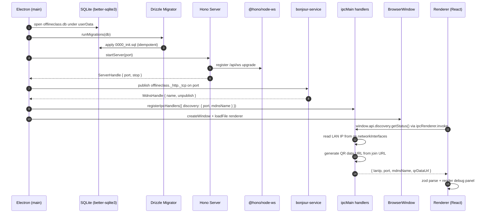
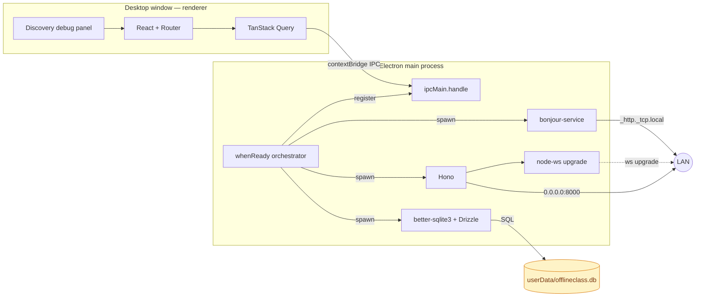

# Stage 0 — Foundation

> **Goal:** every plumbing component starts up cleanly. No screens for the teacher or student yet; the desktop renderer shows a debug panel with the LAN IP, port, mDNS name and join-URL QR.

## Boot sequence



## Process / network architecture



## Stack table — what each piece does

| Layer | Library / tech | Why this one |
| --- | --- | --- |
| Persistence | `better-sqlite3` | Synchronous, embeds the sqlite3 engine — perfect for a single-process desktop app. No connection pool, no daemon. |
| ORM | `drizzle-orm` + `drizzle-kit` | Schema-first TypeScript with file-based migrations. Generated SQL is readable for the LSOR banca. |
| HTTP | `hono` + `@hono/node-server` | Tiny, TS-first router. Same `app.fetch` shape used by Bun, Cloudflare Workers — easy to test outside Electron later. |
| WebSocket | `@hono/node-ws` | Hono-aware adapter that upgrades requests through the same router; avoids running a separate `ws` Server on its own port. |
| Service discovery | `bonjour-service` | Pure-JS mDNS — no native rebuild per OS. Announces `offlineclass._http._tcp.local` so students don't memorize IPs. |
| Join URL render | `qrcode` | Renders the LAN URL as an SVG/PNG data URL in the renderer. |
| Renderer state | `@tanstack/react-query` | Caches the IPC result so the debug panel doesn't refetch on every render. |
| Renderer routing | `react-router-dom` (hash router) | `file://` URLs in packaged builds don't support BrowserRouter; HashRouter does. |
| Schema sharing | `@offlineclass/shared` (workspace) | One zod schema (`DiscoveryStatus`) used by both the IPC handler and the renderer; will grow per stage. |

## Network technologies introduced

- **TCP** on `0.0.0.0:8000` — the Hono server binds to the wildcard address so any LAN interface can reach it. Loopback would have hidden the server from the students' phones.
- **HTTP/1.1** — the `GET /api/health` probe and the WS upgrade share the same TCP socket.
- **WebSocket (RFC 6455)** — `GET /api/ws` with `Upgrade: websocket` triggers `@hono/node-ws` to switch the connection from HTTP to a framed full-duplex stream.
- **mDNS / DNS-SD (RFC 6762 + 6763)** — `bonjour-service` sends multicast on `224.0.0.251:5353` advertising the `_http._tcp` service. Anyone on the same L2 segment resolves `offlineclass.local` without a central DNS server.
- **IPC over Unix domain socket / named pipe** — `contextBridge` + `ipcRenderer.invoke` flow over the Electron-internal channel, isolated from the LAN. The teacher's discovery query never touches the network.

## What can break this picture

| Failure mode | What happens | Stage 0 response |
| --- | --- | --- |
| Port 8000 already in use | `serve()` rejects | bootstrap throws, app quits; log surfaces the conflict. Override via `OFFLINECLASS_PORT`. |
| Wi-Fi + Ethernet both up | `getLanIp()` returns the first IPv4 it sees (Wi-Fi wins on most laptops) | Acceptable in this stage; Stage 7 will let the teacher pick the interface. |
| LAN router blocks multicast | mDNS never propagates | Students can still reach the IP — the QR encodes the raw `http://<ip>:<port>/`, not the `.local` name. |
| First boot — no DB file | `runMigrations` creates schema | Idempotent; safe to call on every boot. |
| User-data dir missing | `getDb()` `mkdirSync(..., recursive)` creates it | Handled. |

## Verification (manual)

```bash
# 1. Window opens, panel shows IP + QR + ws:// + curl probe.
pnpm --filter @offlineclass/desktop dev

# 2. From another shell, hit the health endpoint:
curl http://<ip-shown-in-panel>:8000/api/health
# → { "ok": true }

# 3. Upgrade a WS connection:
wscat -c ws://<ip-shown-in-panel>:8000/api/ws
# > { "type": "echo", ... } back when you type anything.

# 4. Confirm mDNS broadcast (macOS):
dns-sd -B _http._tcp
# → offlineclass

# 5. Confirm the DB file exists with the migrated tables:
sqlite3 "$HOME/Library/Application Support/@offlineclass/desktop/offlineclass.db" ".schema"
# → CREATE TABLE answers ...
```

## What this stage does NOT cover (intentionally)

- No teacher auth (Stage 1).
- No exam editor (Stage 2).
- No `sessions` lifecycle, no `students` POST `/api/join`, no real WS message shapes — the WS endpoint is a stub that echoes back to the sender.
- No student SPA — `apps/student-web` still ships the create-vite hello-world (Stage 6 rewrites it).
- No packaged build path — migrations and `app.getAppPath()` only resolve correctly in `electron-vite dev`. Stage 7 fixes the asar/resources layout.
