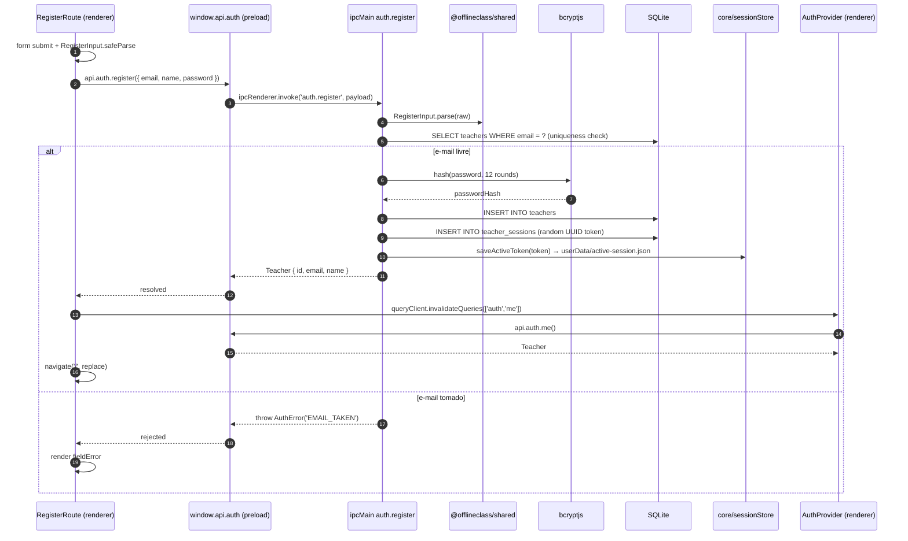
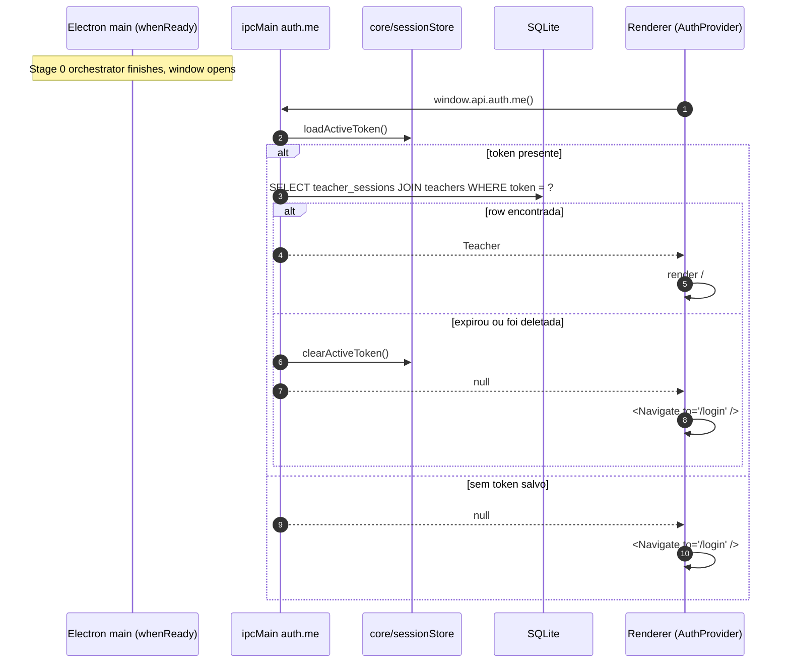

# Stage 1 — Teacher auth

> **Goal:** a teacher can register, log in, log out, and the desktop app remembers them across restarts. Everything that isn't `/login` or `/register` requires a teacher.

## Sign-up sequence



## Boot — re-auth from disk



## Process architecture — auth lives only in IPC

```mermaid
flowchart LR
    subgraph Electron[Electron main process]
        IpcAuth[ipcMain auth.*]
        BCrypt[bcryptjs]
        SessionsMod[auth/sessions.ts]
        Store[core/sessionStore.ts]
        Teachers[(teachers)]
        TeacherSessions[(teacher_sessions)]
        ActiveSessionFile[(userData/active-session.json)]:::file
    end

    subgraph Renderer[Renderer]
        Forms[Login / Register / Home routes]
        AuthCtx[AuthProvider + RequireAuth]
        Query[TanStack Query ['auth','me']]
    end

    LAN((LAN))

    Forms -- contextBridge IPC --> IpcAuth
    AuthCtx --> Query
    Query -- IPC --> IpcAuth

    IpcAuth --> BCrypt
    IpcAuth --> SessionsMod
    SessionsMod --> Teachers
    SessionsMod --> TeacherSessions
    IpcAuth --> Store
    Store --> ActiveSessionFile

    LAN -. zero arrows .-> Renderer
    LAN -. zero arrows .-> IpcAuth

    classDef file fill:#fef3c7,stroke:#d97706,color:#78350f;
```

The "zero arrows" annotation is the point: nothing on the LAN can reach auth. A student device on the same subnet can curl `/api/health` but cannot reach `auth.login` — there is no HTTP route for it.

## Stack table — what each piece does

| Piece | Why this one |
| --- | --- |
| `bcryptjs` (12 rounds) | Pure-JS, no extra native module to rebuild against Electron's Node. 12 rounds ≈ ~250ms — high enough to make brute force painful, low enough that login still feels instant. |
| `node:crypto.randomUUID()` | Sessions tokens; 128 bits, collision-resistant, no extra dep. |
| Drizzle on better-sqlite3 (sync) | The session helpers are synchronous (`.get()`, `.run()`) which keeps the IPC handler control flow simple — no transactions yet, kept for Stage 2 when the form builder needs them. |
| `userData/active-session.json` plain file | Single-reader (the main process); a DB row would have worked too but `loadActiveToken()` on boot would have to open the DB just to read one string. |
| TanStack Query `staleTime: Infinity` for `['auth','me']` | The auth state only changes on login/logout/register, all of which invalidate the query explicitly. No need to refetch on focus or interval. |
| HashRouter `RequireAuth` / `RedirectIfAuthed` | Cheap route gating; alternative was a global middleware-style loader, but routes are few enough that the explicit wrap is clearer. |

## Threat model — what auth actually defends against

| Threat | Defended? | Notes |
| --- | --- | --- |
| Another teacher on the same machine | ✅ | Login is required even though the data lives locally — credentials separate two teachers sharing one classroom PC. |
| Student on the LAN guessing endpoints | ✅ | Auth never reaches HTTP. There is no `POST /api/login` to scan for. |
| Student opening DevTools on a peer's window | n/a | Students don't run the Electron app. The renderer DevTools shortcut is locked in prod by `@electron-toolkit/utils`. |
| Stolen `active-session.json` | ⚠️ | Anyone who reads the file from disk gets the token. We rely on OS-level user-data dir permissions; whole-disk attacker is out of scope (academic). |
| Password reuse / weak passwords | partial | Minimum 8 chars; no breach-list check. Academic scope. |
| Database file copied to another machine | ⚠️ | bcrypt makes mass cracking expensive but not impossible. Same out-of-scope note. |

## What this stage does NOT cover

- Password reset, "forgot password" — not needed; the teacher can register again or recover via the SQLite file in `userData`.
- Email verification — single-machine context, no SMTP available offline.
- Session expiry / rotation — `expires_at` column exists but is `NULL` for now; revisited if/when there's a reason to evict idle sessions.
- Permissions / roles — every teacher can do everything. The schema has `owner_id` on `exams` and `exam_sessions` so teachers see their own data, but no row-level enforcement yet.
- Student auth — Stage 3+ introduces ephemeral student tokens over HTTP, a different shape entirely.

## Verification (manual)

```bash
pnpm dev   # window opens at /login (no active session)

# 1. Click "Cadastre-se" → submit { email, name, password }
#    → app redirects to / with "Olá, {name}"

# 2. Quit (Cmd+Q) and reopen → still on /, no re-login required

# 3. Click "Sair" → returns to /login, active-session.json removed

# 4. Try registering the same email again → "E-mail já cadastrado"

# 5. Login with wrong password → "Credenciais inválidas" (no leak of
#    whether the email exists)

# 6. Inspect the DB:
sqlite3 "$HOME/Library/Application Support/@offlineclass/desktop/offlineclass.db" \
  "SELECT id, email, name FROM teachers; SELECT token, teacher_id FROM teacher_sessions;"
```
