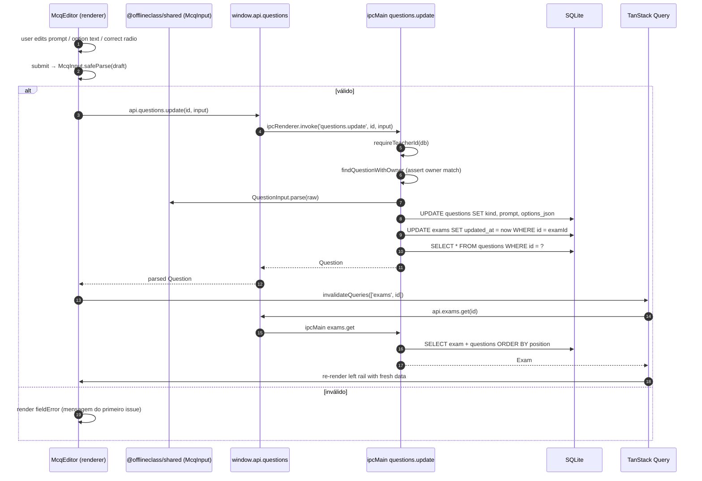
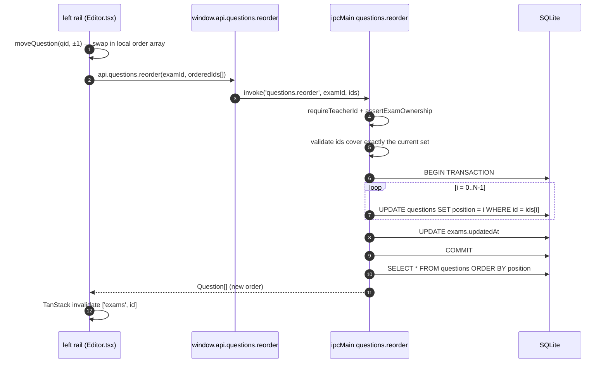
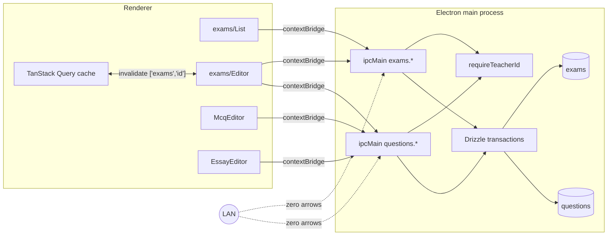

# Stage 2 — Form builder

> **Goal:** the teacher can build, edit, reorder, delete, and duplicate exams made of MCQ and dissertative questions. Everything is persisted to SQLite; no LAN exposure yet.

## Edit-and-save sequence



## Reorder via up/down arrows



## Process architecture — still IPC-only



Same boundary as Stage 1: exam content lives entirely in IPC. A student device on the LAN can't list exams or even check which ones exist — there's no HTTP route. That's intentional; exposing exams over HTTP comes in Stage 3 **only** through the scoped `/api/session/active` endpoint, which only returns the exam attached to the currently-running session.

## Persistence model

```mermaid
erDiagram
    teachers ||--o{ exams : "owner_id"
    exams ||--o{ questions : "exam_id (cascade)"
    questions ||--o| answers : "FK from answers (cascade)"

    questions {
        text id PK
        text exam_id FK
        int position
        text kind "mcq | essay"
        text prompt
        text options_json "JSON when kind=mcq, NULL otherwise"
    }
    exams {
        text id PK
        text owner_id FK
        text title
        text description NULLABLE
        int created_at
        int updated_at
    }
```

`options_json` is a JSON-encoded `McqOption[]` (`{ id, text, correct }`). Stored as a single column because:

1. Question count is small (typical exam: <30 questions); options per MCQ smaller still (≤8).
2. We never query *into* options — the renderer always reads them as a whole when editing, and the student bundle (Stage 6) also receives them whole.
3. Keeping options in a column instead of a child table sidesteps a transaction every time the teacher reorders or relabels — single `UPDATE questions SET options_json = ?` is cheaper.

The unique index on `(exam_id, position)` would have caused deadlocks during reorder if we updated positions in place, so reorder happens inside a transaction that wipes-and-rewrites positions one at a time. Same for delete: positions are compacted to keep them contiguous (0..N-1).

## Stack table — what's new here

| Piece | Why |
| --- | --- |
| `z.discriminatedUnion('kind', [McqInput, EssayInput])` | Same `Question` type validates IPC payloads now AND will validate the HTTP payload student-web fetches in Stage 6 — one schema, two transports. |
| Drizzle `db.transaction(tx => ...)` | Reorder + position compaction are multi-statement and need atomicity. Drizzle's tx callback is sync on the better-sqlite3 driver. |
| `sql<number>` template + COALESCE | `nextPosition = MAX(position) + 1` in one SQL roundtrip; defaults to 0 for an empty exam. |
| shadcn `Dialog`, `DropdownMenu`, `RadioGroup`, `Textarea` | Added this stage. Each `pnpm dlx shadcn add ... -c apps/desktop`. |
| TanStack Query invalidate-after-mutate | Every mutation invalidates `['exams', id]`. The left rail and active editor pick up the same fresh `Exam` snapshot, so reorder/delete/edit are all "one source of truth" updates. |
| `key={selected.id}` on the editor components | Forces remount when the teacher selects a different question, which discards stale draft state inside the form. Cheap correctness trick. |

## Threat / failure modes

| Concern | How Stage 2 handles it |
| --- | --- |
| Teacher A tries to edit Teacher B's exam | Every handler calls `requireTeacherId` and `assertExamOwnership` / `findQuestionWithOwner`. The DB query already filters on `owner_id`; the handler throws `DomainError('NOT_FOUND')` rather than `FORBIDDEN` to avoid leaking the existence of someone else's exam. |
| Empty exam title, missing options, duplicate "correct" markers | All caught by `ExamInput` / `McqInput` zod refinements at parse time. Renderer surfaces the first issue's message. |
| Reorder request with the wrong number / mismatched ids | Server cross-checks `orderedIds` against the current question set; rejects on mismatch before touching the DB. |
| Crash mid-reorder | The whole reorder happens in one Drizzle tx; better-sqlite3 rolls back on throw, leaving positions consistent. |
| User loses tab focus mid-edit | Form is uncontrolled-per-question (local `useState`) with a manual "Salvar questão" button. Closing the editor without saving discards changes by design — no auto-save magic to misfire. |
| Deleting a question that already has answers (Stage 4+) | The `answers.question_id` FK uses `ON DELETE CASCADE` — answers vanish with the question. We will revisit this when the live dashboard ships and "deleting a question mid-session" becomes a real concern. |

## What this stage does NOT cover

- Drag-and-drop reorder — replaced with up/down arrow buttons for MVP. `@dnd-kit/sortable` is an obvious future swap if the UX matters.
- Question types beyond MCQ + essay (true/false, ordering, matching, code) — out of scope for v1; the discriminated-union schema makes adding more types a localized change.
- Per-question points / weighting — every question is worth the same; grading is manual outside the app.
- Auto-save — explicit "Salvar" buttons. Cheaper to reason about for this stage.
- Inline image / file attachments in questions — the schema has no place for them yet.

## Verification (manual)

```bash
pnpm dev   # already logged in from Stage 1

# 1. Home → "Abrir provas" → /exams
# 2. "Nova prova" → title "P1 — Redes" → opens editor at /exams/<id>
# 3. "Adicionar questão" → Múltipla escolha → 4 options, mark one correct, "Salvar questão"
# 4. Repeat with two more MCQs
# 5. "Adicionar questão" → Dissertativa → edit prompt, "Salvar"
# 6. Hover a question → up/down arrows → reorder; refresh window, order persists
# 7. Edit exam title → "Salvar dados da prova" → button greys out
# 8. Hover a question → trash → confirm → row disappears, positions compact
# 9. Back to /exams → ... → "Duplicar" → "P1 — Redes (cópia)" with all questions
# 10. Inspect DB:
sqlite3 "$HOME/Library/Application Support/@offlineclass/desktop/offlineclass.db" \
  "SELECT id, title FROM exams; SELECT id, exam_id, position, kind FROM questions ORDER BY exam_id, position;"
```
