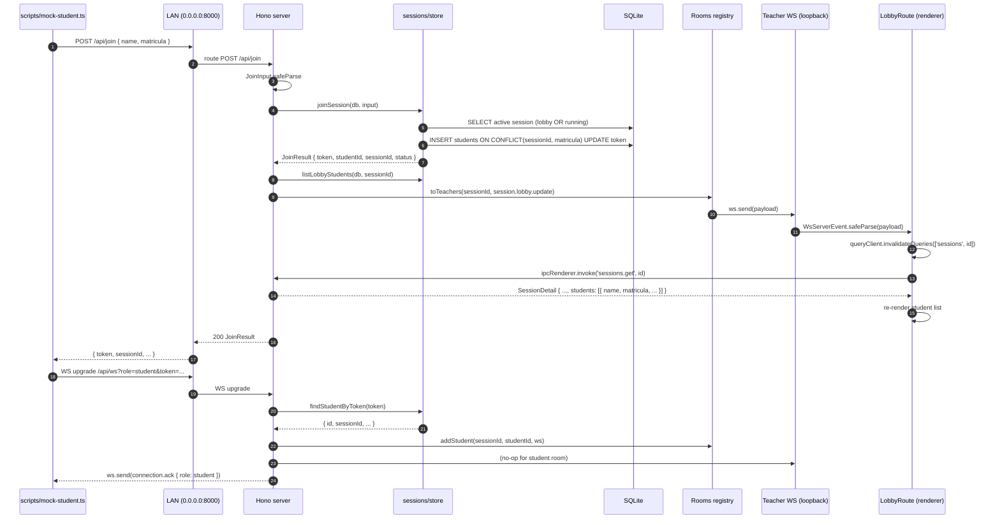
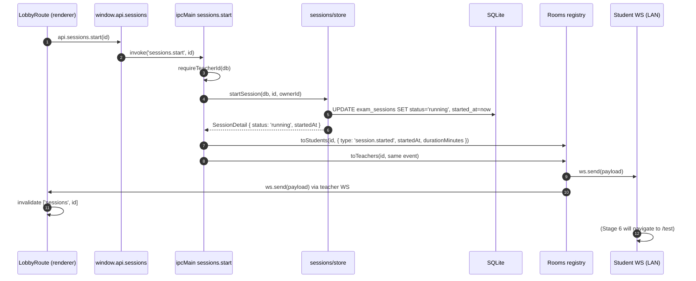

# Stage 3 — Quiz session lobby

> **Goal:** teacher picks an exam, opens a lobby with QR + mDNS info, and watches students appear over WebSocket in real time. Session lifecycle: `lobby → running → ended`.

## Student joins, teacher sees the row appear



## Teacher hits "Iniciar prova"



## Network architecture — first stage with real LAN traffic

```mermaid
flowchart LR
    subgraph Electron[Electron main process]
        IpcSessions[ipcMain sessions.*]
        IpcAuth[ipcMain auth.getToken]
        Hono[Hono router]
        WsUpgrade[@hono/node-ws upgrade]
        RoomsReg[Rooms registry]
        Store[sessions/store]
        DB[(SQLite)]
        mDNS[bonjour-service]
    end

    subgraph Renderer[Desktop renderer]
        Lobby[LobbyRoute]
        New[NewSessionRoute]
        Query[TanStack Query]
        TWs[lib/ws connectWs - loopback]
    end

    subgraph LAN[LAN]
        Student[Student device]
    end

    New -- IPC --> IpcSessions
    Lobby -- IPC --> IpcSessions
    Lobby -- IPC --> IpcAuth
    Query -. invalidate .-> Lobby

    Lobby --> TWs
    TWs -- ws 127.0.0.1 --> WsUpgrade

    Student -- POST /api/join --> Hono
    Student -- WS /api/ws role=student --> WsUpgrade
    Student -- GET /api/session/active --> Hono

    Hono --> Store
    WsUpgrade --> RoomsReg
    IpcSessions --> Store
    IpcSessions -- broadcast --> RoomsReg
    Store --> DB
    RoomsReg --> WsUpgrade

    mDNS -. _http._tcp.local .-> Student
```

The teacher's WebSocket binds to `ws://127.0.0.1:<port>/api/ws` — loopback only. Students connect to the same upgrade endpoint over the LAN (`ws://<lan-ip>:<port>/api/ws`). Both flow through the same `injectWebSocket(server)` call in `server/index.ts`; routing happens by the `?role=` query string.

## Stack table — what's new

| Piece | Why |
| --- | --- |
| `@hono/node-ws` `upgradeWebSocket()` with role-aware auth | Reads `?role=`, `?token=` and `?sessionId=` before accepting the upgrade; rejects with WS close code 4001 on bad credentials. One handler covers both client kinds. |
| `Rooms` Map keyed by `WSContext` | O(1) removal on close; no string-keyed lookup gymnastics. Broadcast scopes (`toTeachers`, `toStudents`, `toAll`) are predicate-based. |
| Drizzle `onConflictDoUpdate` on `(sessionId, matricula)` | Re-joining with the same matrícula refreshes the token and lastSeenAt instead of erroring — handles network hiccups, refresh, mobile sleep. Trade-off documented in `joinSession`. |
| Loopback URL for the teacher's WS | The teacher's WS lives in the same process as the server; binding to LAN-resolvable IP would be a misdirection. `ws://127.0.0.1` avoids accidental LAN exposure of teacher events. |
| `WsServerEvent.safeParse` on every incoming WS message | Same zod schema validates server-emitted payloads in the renderer. Drops anything off-shape. |
| Auto-reconnect with 1.5s backoff (`connectWs`) | Survives Wi-Fi blips; never gives up unless the renderer explicitly `close()`s on unmount. |
| `tsx` + Node 22 native `WebSocket` for `mock-student` | No extra runtime deps; the script is two `fetch` and one `new WebSocket()` away from being a curl one-liner. |

## Threat / failure modes

| Concern | Stage 3 response |
| --- | --- |
| Student forges `?role=teacher` to spy on the lobby | Teacher WS requires both a valid teacher-session token AND a `sessionId` they own. Students don't have either. |
| Two teachers try to open the lobby at once | `createSession` rejects with `ALREADY_ACTIVE` if any session is in lobby/running. The frontend resolves this by reading `sessions.active()` and offering "Voltar ao lobby". |
| Student refreshes their tab mid-lobby | `joinSession` upserts on (sessionId, matricula), re-issuing the token. The teacher's row stays put — no duplicate. |
| Student leaves the LAN | WS `onclose` fires; `Rooms.remove(ws)` clears the subscription. No state leak. The student's DB row stays — Stage 4 will mark it idle. |
| LAN multicast blocked (mDNS fails) | `dns-sd` doesn't surface `offlineclass.local`, but the QR encodes the raw `http://<ip>:<port>/` — students can still join. |
| Teacher tab crashes mid-session | Server keeps `exam_sessions.status` as is. Reopening the app → `sessions.active()` returns the row → Home links straight back to the lobby. |
| WS payload not zod-shaped | `safeParse` drops it; renderer doesn't crash. Server only emits validated `WsServerEvent`s, so this is defensive only. |
| Race: teacher hits "Iniciar" while student is mid-join | Both succeed; the student lands in a `running` session. Without `allowLateJoin` they would have been rejected — `joinSession` checks status before insert. |

## What this stage does NOT cover

- The student SPA itself — Stage 6 replaces the create-vite hello-world.
- Heartbeats / idle detection — Stage 4 (live dashboard).
- Answer submission and progress reporting — Stage 4.
- Reconnect-with-resume after WS drop on the student side — auto-reconnect is in `connectWs`, but the server has no replay buffer; an event missed during the gap is just gone. Acceptable given lobby state is fully derivable from the DB on the next `session.lobby.update`.
- Exports — Stage 5.
- Multiple concurrent sessions per teacher — explicitly rejected by `createSession`.

## Verification (manual)

```bash
# Terminal 1
pnpm dev   # restart if it was already running — preload changed

#   1. Home → "Aplicar prova" → /sessions/new
#   2. Pick an exam, set duration = 10, leave "Permitir entradas após início" off
#   3. "Abrir lobby" → /sessions/<id>, status pill "No lobby", QR visible

# Terminal 2
pnpm mock-student --name "Eliezir" --matricula "2024001"
#   stdout shows: joined, ws open, connection.ack { role: student }
#   teacher lobby shows the row "Eliezir / 2024001" within ~200ms

# Terminal 3
pnpm mock-student --name "Pedro" --matricula "2024002"
#   second row appears in the lobby

# Back in the Electron window:
#   4. Click "Iniciar prova"
#      → Terminal 2 + 3 each receive: session.started { startedAt, durationMinutes }
#      → status pill turns green "Em andamento"

# Try a duplicate-matricula re-join:
pnpm mock-student --name "Eliezir 2" --matricula "2024001"
#   Original Eliezir's token is invalidated, the row name updates.

# Click "Encerrar sessão" → confirm:
#   → session.ended broadcast to all mocks
#   → mocks log the event; their WS stays open (server doesn't close it)
#   → status pill turns "Encerrada", QR card hidden
```
