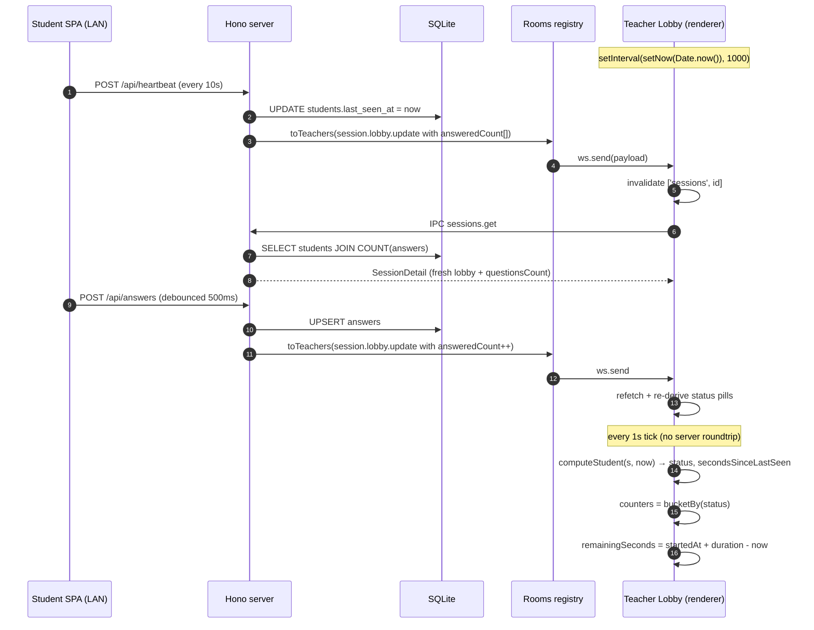
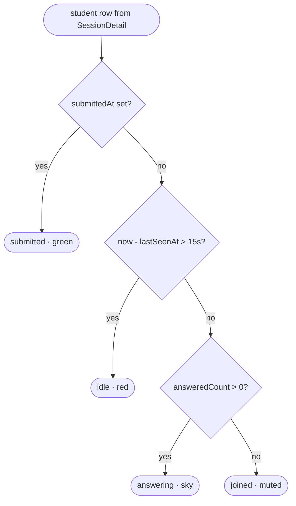

# Stage 4 — Live dashboard

> **Goal:** the teacher's lobby view turns into a real-time monitoring grid during a running session. Status pills, idle detection, aggregate counters, and a countdown — all derived from data Stage 6 was already streaming.

> **Note on ordering:** Stage 6 (student SPA) landed before this one because the dashboard is impossible to test without students. The backend pieces this stage needs (lastSeenAt heartbeats, answeredCount, submittedAt) were all wired in Stage 6.

## What happens per tick



## Per-student status derivation



Idle isn't stored anywhere — it's a pure function of `now - lastSeenAt`. The teacher's 1Hz tick keeps it honest without server work.

## Dashboard layout

```
┌──────────────────────────────────────────────────────────────────┐
│  P1 — Redes                                          ┌─────────┐ │
│  Em andamento · 60 min · WS: open                   │ 47:23   │ │
│                                                       └─────────┘ │
│                                                                    │
│ ┌──────────┐ ┌──────────┐ ┌──────────┐ ┌──────────┐               │
│ │Conectados│ │Respondend│ │ Enviaram │ │ Inativos │               │
│ │    23    │ │    18    │ │     2    │ │     3    │               │
│ └──────────┘ └──────────┘ └──────────┘ └──────────┘               │
│                                                                    │
│ ┌────┐  ┌──────────────────────────────────────────────────────┐  │
│ │ QR │  │ Alunos (23)                                          │  │
│ │    │  │ ┌──────────────────┐ ┌──────────────────┐            │  │
│ └────┘  │ │ Eliezir 2024001  │ │ Pedro 2024002    │            │  │
│ http..  │ │ 5/8  há 2s  ●Resp│ │ 8/8  há 0s ●Env. │            │  │
│         │ └──────────────────┘ └──────────────────┘            │  │
│         │ ┌──────────────────┐ ...                              │  │
│         │ │ Raphael 2024003  │                                  │  │
│         │ │ 2/8  há 27s ●Ina │                                  │  │
│         │ └──────────────────┘                                  │  │
│         └──────────────────────────────────────────────────────┘  │
└──────────────────────────────────────────────────────────────────┘
```

## Stack table — what's actually new

| Piece | Why |
| --- | --- |
| `setInterval(setNow(Date.now()), 1000)` in the lobby | The cheapest live-update mechanism — no server roundtrip, just a derived re-render. Pauses naturally when the tab/window is hidden because `setInterval` slows down to ~1s anyway. |
| Status pill colors are tailwind classes, not theme tokens | Sticking to `bg-green-500/15 text-green-700 dark:text-green-300` etc. keeps the pills predictable across the shadcn Nova theme without spinning new design tokens for "alert" colors. |
| `SessionDetail.questionsCount` (added this stage) | The lobby card shows `answeredCount / questionsCount`. A second IPC call to fetch the exam would have worked but a `COUNT(*) FROM questions` subquery on `loadDetailById` is one cheap join. |
| Auto-submit on the student SPA when timer hits 0 | Single `useEffect([remainingSeconds, ...])` with idempotence guard. Server-side enforcement (cron job that force-ends running sessions whose timer expired) is deferred — at worst, a student can submit a few seconds after the timer expires; the dashboard renders the answeredCount regardless. |
| All status derivation is local | Server doesn't track `idle` as state. We don't even add a column. The teacher's view is just a transformation of `(lastSeenAt, submittedAt, answeredCount)`. |

## Threat / failure modes

| Concern | Stage 4 response |
| --- | --- |
| Student tab backgrounded; heartbeat pauses | After ~15s they flip to `idle` red. The dashboard makes it instantly visible. Real recovery happens on the student side (the SPA resumes heartbeats when the tab is foregrounded). |
| Student's LAN drops mid-test | Same as backgrounded — they flip to idle. When they reconnect, the next heartbeat / answer brings them back to `answering` automatically. |
| Many students answering rapidly | Each `/api/answers` causes one `session.lobby.update` broadcast. For a class of 30 students answering at ~1Hz peak, that's 30 broadcasts/sec, each a small JSON payload. Acceptable. Server-side debouncing is an easy follow-up if needed. |
| Timer hits 0 but session keeps running | The countdown pulses in red. Teacher decides to click "Encerrar sessão" (or do nothing — late answers still count). Server has no hard deadline yet — listed as Stage 4-bis. |
| Race: student submits exactly at second 0 | Both the auto-submit `useEffect` and a manual click could fire. The mutation guard checks `!submitMutation.isPending && !submitMutation.isSuccess` and the server-side `submitStudent` is idempotent. |
| Teacher closes the lobby tab during running | `cleanup` closes the WS; the server's Rooms entry is dropped. State is still in DB; reopening `/sessions/:id` rehydrates from `sessions.get`. |

## What this stage does NOT cover

- Server-side hard deadline (force-end at startedAt + durationMinutes). All time enforcement is client-side. A determined student with DevTools could keep submitting answers a few seconds past 0; the answers still count.
- Per-question progress detail (drill down into "which questions has each student answered?"). The card shows X/N but no breakdown.
- Re-rank or sort the student grid by status. Order is currently joinedAt-asc.
- Notification when the last student submits. Teacher has to look.
- Exports of submitted answers (Stage 5).

## Verification (manual)

```bash
pnpm --filter @offlineclass/student-web build
pnpm dev   # restart — schemas + UI changed

# Terminal A: teacher creates session, opens lobby (no students yet — counters all 0)

# Terminals B, C, D: simulate students
pnpm mock-student --name "Bot A" --matricula "A001" --answer-every 4 --submit-after 30
pnpm mock-student --name "Bot B" --matricula "B002" --answer-every 6 --submit-after 60
pnpm mock-student --name "Bot C" --matricula "C003" --answer-every 8 --submit-after 90

# Teacher hits Iniciar prova
#   - All three turn from "No lobby" → "Respondendo" (sky)
#   - "Enviaram" counter ticks up at 30/60/90s
#   - Countdown ticks down in the header

# Stop one mock (Ctrl+C in its terminal)
#   - After 15s its row flips to "Inativo" red

# Time-up: after durationMinutes the countdown hits 00:00, pulses red.
# Real students' SPAs auto-submit; mock-students with --submit-after handle their own.

# Open a real phone in parallel to exercise the whole stack against
# the same dashboard — counters and per-student progress should track
# both browser SPAs and mock-students identically.
```
