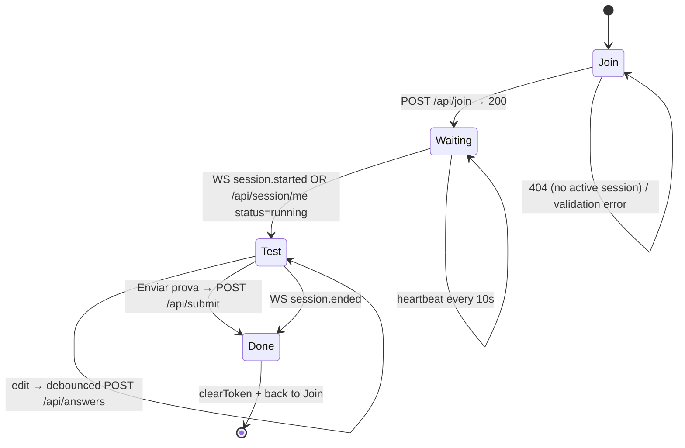
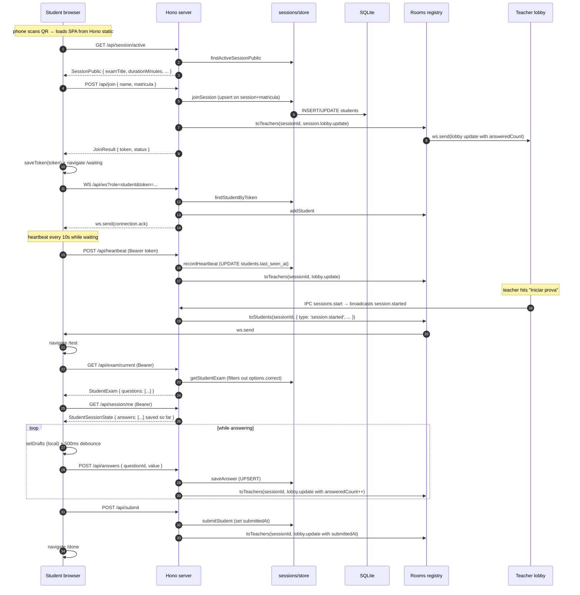

# Stage 6 — Student SPA

> **Goal:** a real student opens the QR URL on their phone, types name + matrícula, waits for the teacher to start, answers the questions, and submits. All via the same Hono server that hosts the API — no separate origin, no CORS.

> **Note on ordering:** the original plan put Stage 4 (live dashboard polish) before Stage 6. We swapped them because the dashboard is hard to test without real students. Stage 4 now follows this one.

## Student lifecycle



## End-to-end exam-taking sequence



## Now the picture is whole

```mermaid
flowchart LR
    subgraph TeacherPC[Teacher PC — Electron]
        Main[main process]
        DB[(SQLite)]
        Hono[Hono server]
        WS[@hono/node-ws]
        Static[apps/student-web/dist served at /]
        Rooms[Rooms registry]
        Renderer[Desktop renderer]
        Main --> DB
        Main --> Hono
        Hono --> WS
        Hono --> Static
        Hono --> Rooms
        Main --> Renderer
    end

    subgraph LAN[LAN]
        Phone[Phone — student SPA]
        Browser[Laptop — student SPA]
    end

    mDNS[(bonjour-service)]
    Main --- mDNS

    Phone -- GET / loads SPA bundle --> Static
    Browser -- GET / loads SPA bundle --> Static
    Phone -- HTTP /api/* (Bearer) --> Hono
    Phone -- WS /api/ws?role=student --> WS
    Browser -- HTTP /api/* --> Hono
    Browser -- WS --> WS
    Renderer -- IPC --> Main
    Renderer -- WS loopback role=teacher --> WS
    Rooms -- broadcast --> Renderer
    Rooms -- broadcast --> Phone
    Rooms -- broadcast --> Browser
```

The student SPA loads from `http://<lan-ip>:<port>/` — the same origin as the API. No CORS, no second port, no proxy. WebSocket and HTTP share the same Hono instance.

## Stack table — what's new

| Piece | Why |
| --- | --- |
| `@hono/node-server/serve-static` + SPA fallback | Single Hono instance serves the SPA AND the API on the same port. Unmatched non-API GETs fall back to `index.html` so deep links (`/test` on refresh) work without server-side routing knowledge. |
| `BrowserRouter` on the SPA (vs HashRouter on desktop) | The student SPA is served over real HTTP; `pushState` is fine and the URLs read nicely on a phone (`http://lan-ip/test`). The desktop uses HashRouter because packaged Electron loads via `file://`. |
| `sessionStorage` for the join token | Survives refresh, dies on tab close — exactly the resume policy we want (close tab → re-enter via Join). `localStorage` would persist across browser sessions which is wrong for an exam. |
| Debounced auto-save (500ms per question) | Cheap UX win: no "save" button per question. Drops back-to-back keystrokes to one POST. Mutation runs in the background; the form is never blocked. |
| `WsServerEvent.safeParse` shared between desktop and student | One schema validates events on both sides. The discriminated union makes the `if (event.type === 'session.started')` branches type-safe. |
| Server strips `options[].correct` for MCQ in `StudentMcqOption` | The student SPA never has the correct flag, even in DevTools. Cheating via inspecting React state is foreclosed at the server. |
| Same-origin SPA → trivial WS URL | `ws://${location.host}/api/ws` is computed at runtime; works whether the teacher is on 192.168.0.10:8000 or 10.0.0.5:80 without any config. |

## Threat / failure modes

| Concern | Stage 6 response |
| --- | --- |
| Student reads the correct MCQ option from DevTools | Server filters `correct` out of `StudentExam`. The teacher-side schema still has it; the LAN-public projection doesn't. |
| Student steals another student's `Bearer` token | Tokens are UUIDv4, in-memory + DB-stored. They live in `sessionStorage` (not URL, not header logs). The threat is real if the teacher demos a sign-in over someone's shoulder; out of scope for the academic threat model. |
| Tab refresh mid-exam | `sessionStorage` survives refresh; `GET /api/session/me` re-seeds the local drafts from saved answers. Countdown is recomputed from `startedAt + durationMinutes`, so it resumes on the right tick. |
| Tab closed mid-exam | Student must re-join. Because `joinSession` is upsert-by-matricula, re-joining issues a new token and the old one is dead (FK on token is unique). Answers persist; the student's existing row is reused. |
| Network blip during answer save | TanStack Query mutation fails silently and the next keystroke retriggers the debounce. The student loses the keystroke that *was* in flight, not earlier answers. |
| Teacher ends the session mid-test | `session.ended` arrives over WS → student navigates to /done. Late `/api/answers` posts get 409 with code BAD_STATE from `saveAnswer`. |
| `student-web` not built (fresh checkout) | Hono returns 503 with a build-command hint instead of an opaque 404. |
| Two students try to use the same matrícula | Upsert means the second one *takes over*. Acceptable for the LAN academic threat model; documented in store.ts. |
| Student SPA bundles a typo of the API path | `/api/*` is centralized in `lib/api.ts`; a typo there fails the build via TS or fails the zod parse at runtime. |
| Mobile screen lock / app backgrounded | Heartbeat interval pauses while the JS event loop is paused. Stage 4 will add idle-flagging on the teacher side (`lastSeenAt > 15s ago`). |

## What this stage does NOT cover

- Live dashboard polish on the teacher side — Stage 4, next. The lobby already shows `answeredCount` per student (the data flows on every answer save), but there's no aggregated "X/N submitted" counter or idle pill yet.
- Time-up auto-submit — the timer reaches 00:00 and stops there; the student must click "Enviar prova". Server doesn't enforce a hard deadline either. Both should land in Stage 4 alongside the dashboard.
- Stricter integrity (lockdown browser, exit detection) — deferred indefinitely; school context is "switch the uplink off and trust", per the project memory.
- Multi-language UI — pt-BR hard-coded.
- Packaged-app path resolution for `apps/student-web/dist` — Stage 7 (electron-builder) will rewrite the static root for the asar layout.

## Verification (manual)

```bash
# 1. Build the SPA so Hono can serve it.
pnpm --filter @offlineclass/student-web build

# 2. Restart the desktop dev server (preload + server changed).
pnpm dev

# 3. As the teacher: Home → Aplicar prova → Nova sessão → pick exam → Abrir lobby.

# 4. On a phone on the same LAN: scan the QR or open http://<lan-ip>:8000/.
#    Type name + matrícula, "Entrar na prova".
#    Teacher lobby shows the row within ~200ms.

# 5. Teacher clicks "Iniciar prova".
#    Phone auto-navigates from /waiting to /test.
#    Student answers a few questions; teacher dashboard's answeredCount
#    ticks on each /api/answers POST.

# 6. Phone refreshes mid-test → still on /test, drafts restored from /api/session/me.

# 7. "Enviar prova" → /done. Teacher row gets a "Enviou" pill.
#    POST /api/answers from the same student now returns 409.

# 8. Stress-test with several mock students answering on a timer:
pnpm mock-student --name "Bot 1" --matricula "M001" --answer-every 3 --submit-after 30
pnpm mock-student --name "Bot 2" --matricula "M002" --answer-every 2 --submit-after 45
```
